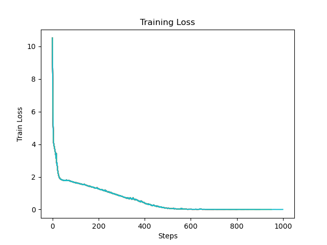
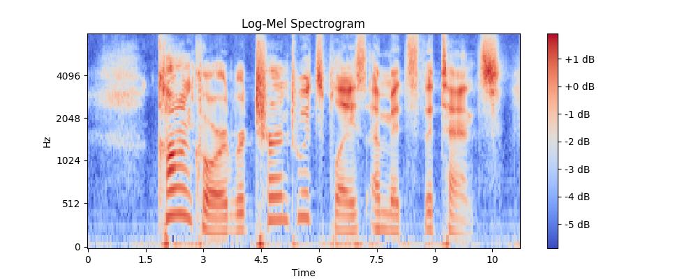
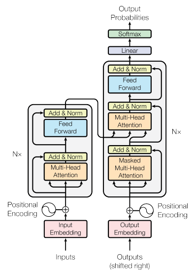

# Whisper-from-Scratch
This project is a reimplementation of OpenAI's voice transcription model, [Whisper](https://openai.com/index/whisper/), from scratch, using a modified version of [Andrej Karpathy's reproduction of GPT-2 (124M)](https://github.com/karpathy/build-nanogpt 'build-nanogpt'). Some components of the Whisper model code are directly used from the [official Whisper repository by OpenAI](https://github.com/openai/whisper/tree/main).

This project is an independent reimplementation and is not affiliated with or endorsed by OpenAI.

# Overview

To adapt Andrej Karpathy's GPT-2 implementation—a decoder-only language model for text generation—into a recreation of Whisper, an encoder was added to convert audio spectrograms into embeddings. Additionally, cross-attention was introduced, enabling these embeddings to interact with text embeddings from transcriptions in the decoder.

The following training loss curve was generated from training for 1000 steps on the LibriSpeech ASR Corpus on an 8x A100 (80 GB SXM4) instance from Lambda Labs.:

|  |

While this plot confirms that the model is learning during training, its performance on test data remains unimpressive. It can transcribe most spectrograms from its training set perfectly, but achieving strong generalization to unseen examples would require an impractically long and costly training process. As a result, this project serves primarily as a proof of concept and a learning exercise.

Audio samples were converted to Log-mel spectrograms like the one below:

Below is a visualization of the original Transformer model from the paper "Attention Is All You Need" that can be used as a rough overview of how Whisper works:

|  |
|:--:|
| Image Credit: https://arxiv.org/abs/1706.03762 |

The spectrograms pass through two Conv1D + GELU layers before entering the Transformer's encoder blocks (left). Meanwhile, the corresponding transcriptions tokenized using the GPT-2 tokenizer are fed into the Transformer's decoder blocks (right). The encoder’s final embeddings interact with embeddings generated from Masked-Multi Head Attention in the decoder through cross-attention, allowing the model to learn the relationship between audio and text features.

Interestingly, Whisper’s overall structure closely resembles that of the original Transformer model, which was initially designed for machine translation. In a sense, transcribing audio can be seen as a form of translation—converting between the 'languages' of sound and text.

# Future Plans

To improve the model's ability to generalize to new audio samples, it will likely need to be trained for much longer on a much larger dataset. For this, I will likely be using the Common Voice Corpus 17.0. It's significantly larger than the LibriSpeech ASR dataset, and the audio samples are shorter on average. This could help a small-scale model converge faster and generalize more effectively with limited training resources.